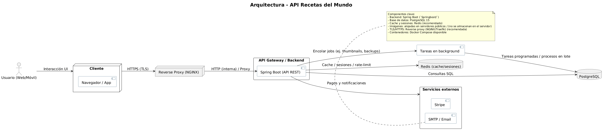
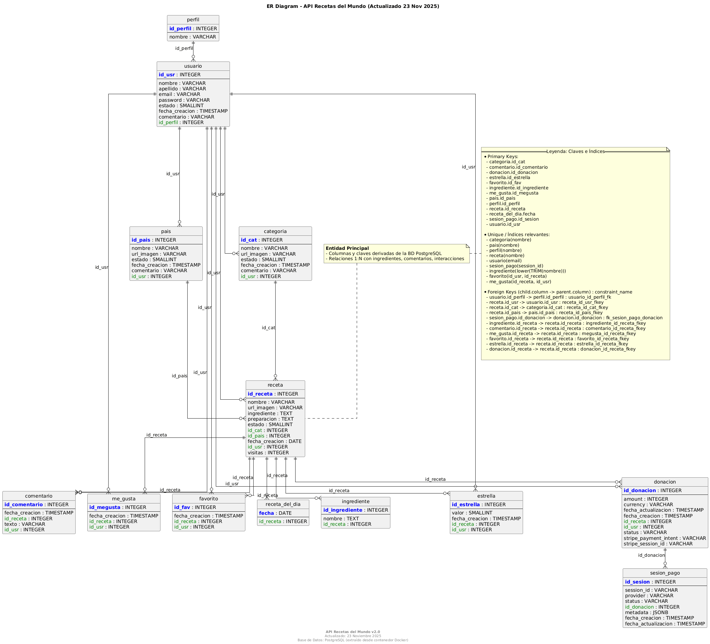
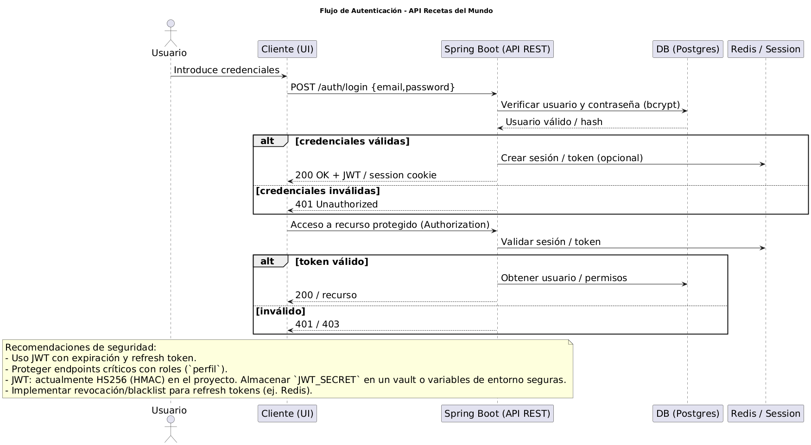
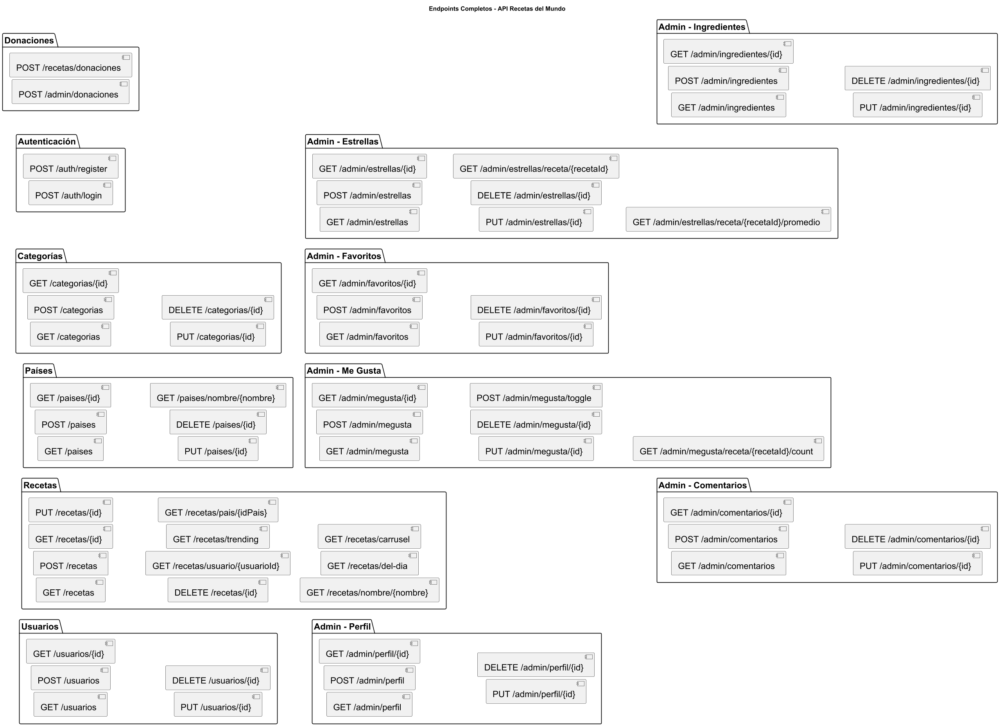
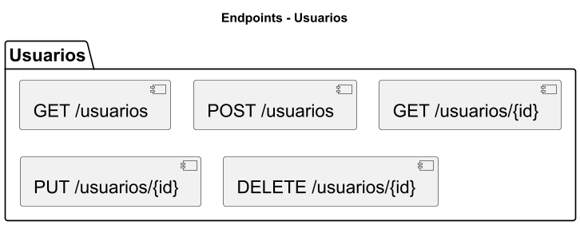
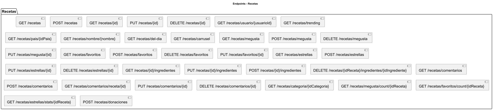
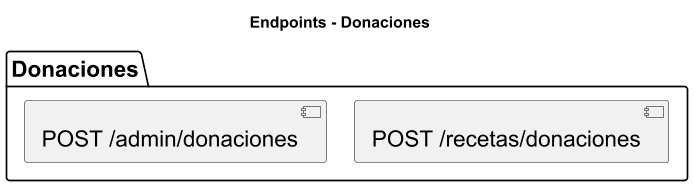
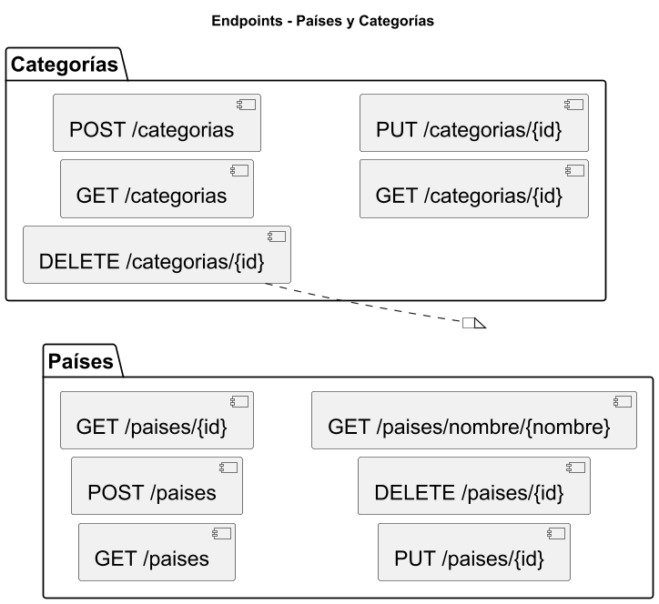
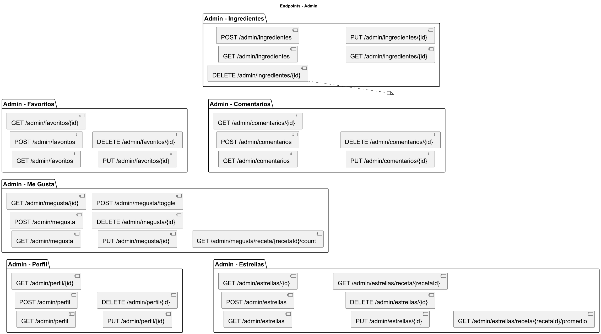

# Recetas del Mundo — API

Resumen ejecutivo
------------------

`Recetas del Mundo` es una API REST diseñada para gestionar una colección curada de recetas, categorizadas por país y tipo, con un sistema completo de interacción social (comentarios, me gusta, favoritos y calificaciones). El proyecto está optimizado para producción con contenedores Docker, documentación OpenAPI y una arquitectura modular que facilita escalado y análisis.
# Recetas del Mundo — API

Versión limpia y ordenada del README para el backend.

Descripción breve
-----------------
API REST contenerizada para gestionar recetas, categorías y las interacciones sociales asociadas (comentarios, favoritos, me gusta y calificaciones). Código backend principal en `Springboot/` y utilidades en `scripts/`.

Contenido clave del repositorio (ruta `backend/`)
- `Springboot/` — código del backend (Java, Maven).
- `docs/` — diagramas PlantUML, SVG y PNG generados (`*.puml`, `*.svg`, `*.png`).
- `database/` — scripts SQL y migraciones.
- `scripts/` — utilidades para backup, generación de diagramas y tareas E2E.

Diagramas
---------
Las imágenes principales están en `docs/` (PNG y SVG). Principales archivos:

- `docs/architecture_diagram.png` — visión de alto nivel de la arquitectura.
- `docs/er_diagram.png` — diagrama entidad-relación (tablas, PK, FK, índices relevantes).
- `docs/auth_flow.png` — flujo de autenticación (JWT).
- `docs/endpoints_overview.png` — mapa de endpoints.
- `docs/endpoints_*.png` — diagramas por módulo (usuarios, recetas, donaciones, admin, paises/categorias).

Regenerar diagramas
-------------------
Se proporcionó un script para regenerar PNG/SVG desde los `.puml`:

```powershell
.\scripts\generate_from_puml.ps1 -Width 1200
```

Instalación y ejecución (desarrollo)
-----------------------------------
Requisitos: `Java` (según la implementación en `Springboot/`), `maven` (si compila localmente), `docker` y `docker-compose` para levantar servicios rápidamente.

Arranque rápido con Docker Compose:

```powershell
# Construir y levantar servicios
docker compose build backend
docker compose up -d
```

Acceso local a la API (ejemplo):

```powershell
curl http://localhost:8081/recetas
```

Configuración
-------------
Edite `config.js` o las variables de entorno según su entorno (DB, Stripe, JWT). No deje secretos checked-in; use `.env` para desarrollo local y un gestor de secretos en producción.

Contribuir
---------
Por favor mantenga el estilo del repositorio y documente cambios relevantes en PRs. Use las carpetas `scripts/` y `docs/` para utilidades y diagramas.

Contacto y licencia
-------------------
Contacto: `dev@recetas.cl` (sustituir por el correo real).

Licencia: MIT

---

Archivo generado: versión limpia del README creada el 23 Nov 2025


# Producción (usar archivo prod y un .env con variables seguras)
docker compose -f docker-compose.prod.yml --env-file .env up -d
```

Recomendaciones:

- No mantengas secretos en los archivos `docker-compose` ni en el repo. Usa `.env` (no versionado) o un gestor de secretos para valores sensibles (DB password, JWT secret, claves Stripe).
- `docker-compose.yml` es cómodo para desarrollo; `docker-compose.prod.yml` refleja el comportamiento esperado en despliegues (imágenes ya construidas, volúmenes administrados por la plataforma).
- Para entornos Windows use Git Bash o WSL cuando ejecute los scripts de backup/restore que dependen de utilidades POSIX (tar, mktemp). Hay un script PowerShell `scripts/restore_volumes_from_backup.ps1` para restauración de volúmenes desde Windows, pero la vía más robusta es ejecutar `scripts/restore_recetas_stack.sh` desde WSL/Git-Bash.

### Variables de entorno importantes

- `JWT_SECRET` — secreto para firmar JWT.
- `JWT_EXPIRATION_MS` — tiempo de expiración del token (ms).
- `DATABASE_URL` / `SPRING_DATASOURCE_*` — conexión a Postgres.
- `STRIPE_SECRET_KEY` — (opcional) para activar pagos/checkout real.

> Nota: No dejes claves en el repo. Usa variables de entorno o un archivo `.env` excluido en `.gitignore`.

---

-## Documentación de API

- Swagger/OpenAPI: la app expone `/swagger-ui/index.html` cuando está en marcha.
- Guía de endpoints completa (resumen y ejemplos): `docs/ENDPOINTS-COMPLETOS.md`.

### Endpoints destacados

- Autenticación: `POST /auth/login`, `POST /auth/register`.
- Recetas: `GET /recetas`, `GET /recetas/{id}`, `POST /recetas` (crear con ingredientes), `PUT /recetas/{id}`, `DELETE /recetas/{id}`.
- Interacciones centralizadas bajo `/recetas/*`: favoritos, me_gusta, estrellas, comentarios e ingredientes (agregar/actualizar/eliminar).
- Otros: `/categorias`, `/paises`, `/usuarios`.

Consulta `docs/ENDPOINTS-COMPLETOS.md` para la lista y ejemplos de uso.

---

## Diagramas (galería)

Los diagramas clave del proyecto (generados desde `docs/*.puml`) se listan a continuación en orden lógico. Para regenerarlos localmente use:

```powershell
.\scripts\generate_from_puml.ps1 -Width 1200
```

1. Arquitectura — visión general de componentes

	 

	 Muestra la composición del sistema (cliente, reverse proxy, backend, base de datos, backups). Útil para planear despliegue y operaciones.

2. Diagrama ER — modelo entidad-relación (integridad referencial)

	 

	 Representa tablas, PKs, FKs e índices principales; referencia para migraciones y diseño de consultas.

3. Flujo de autenticación — proceso de login/registro

	 

	 Describe emisión y uso de JWT, revocación y consideraciones de seguridad.

4. Endpoints — vista general de la API

	 

	 Mapa de los módulos expuestos por la API: `auth`, `usuarios`, `recetas`, `categorias`, `donaciones` y administración.

5. Detalles por módulo (endpoints)

	 - Usuarios

		 

	 - Recetas

		 

	 - Donaciones

		 

	 - Países y Categorías

		 

	 - Administración

		 

---

## Backups y restauración

- Hay scripts para backup en `scripts/` (PowerShell y bash). Los scripts principales son:

	- `scripts/backup_recetas_stack.sh` — crea un backup completo que incluye: imágenes Docker, dump SQL, configuración y (cuando se detectan) volúmenes. Resultado: `backups/complete_backup_YYYYMMDD_HHMMSS.tar.gz`.
	- `scripts/restore_recetas_stack.sh` — restaura imágenes, volúmenes y (opcionalmente) importa el dump SQL. Diseñado para ejecutarse en Linux/WSL/Git-Bash; acepta variables de entorno como `DEPLOY_DIR` y `COMPOSE_UP`.

- El dump SQL principal suele estar en `database/init.sql` (asegúrate que esté en UTF-8 sin BOM). Si tu dump tiene problemas de encoding conviértelo a UTF-8 antes de usarlo.

## Pruebas E2E

- Scripts E2E en PowerShell: `scripts/e2e_*.ps1`. Están preparados para ejecutarse contra `http://localhost:8081`.
- Variables útiles: `E2E_BASE_URL`, `E2E_EMAIL`, `E2E_PASSWORD`.

---

## Contacto

Equipo de desarrollo — `dev@recetas.cl` (consulta la documentación de la API vía Swagger UI para más metadatos de contacto).

---

## Conclusión

API Recetas del Mundo ofrece una base técnica sólida para productos culinarios digitales que requieren estabilidad, seguridad y capacidad de crecer a escala. Está pensada para equipos que necesitan una solución híbrida —capaz de coexistir con sistemas legacy y migrar hacia la nube— reduciendo riesgos operacionales y acelerando la entrega de valor.

Puntos clave:

- Despliegue reproducible (imágenes, Pipelines — integración y despliegue continuos).
- Escalabilidad horizontal mediante servicios stateless y réplicas.
- Operaciones seguras: gestión de secretos, backups automatizados y rotación.

© 2025 API Recetas del Mundo. Todos los derechos reservados.

