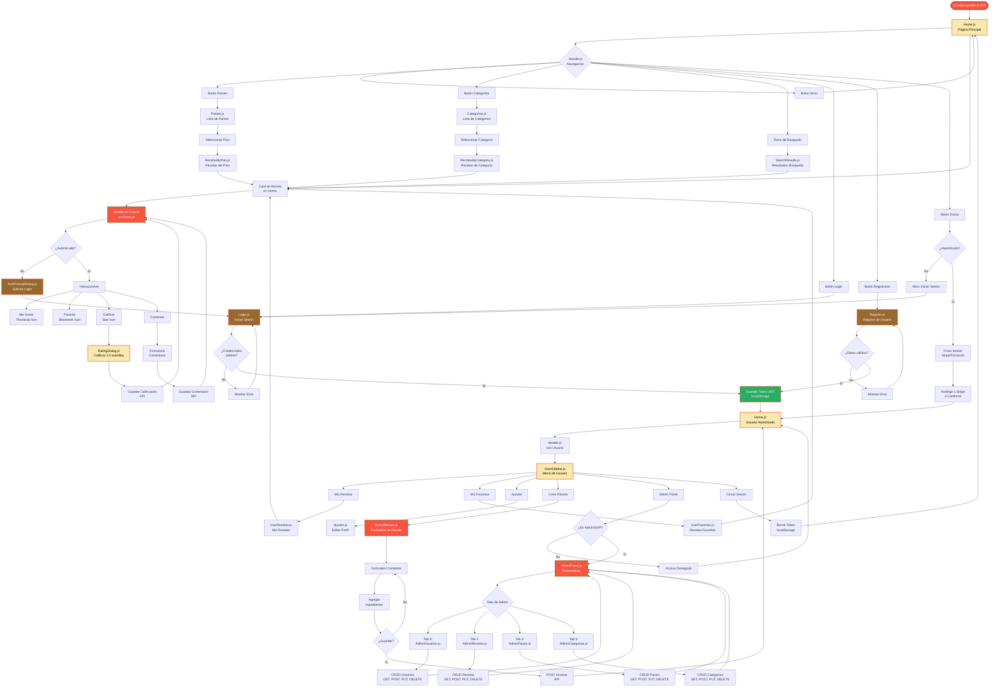

# Diagrama de Flujo - Navegación Recetas Del Mundo

## Flujo de Navegación del Usuario (Basado en Componentes React)

## Componentes React Identificados

### **Páginas Principales:**
- `Home.js` - Página de inicio con recetas trending y receta del día
- `Login.js` - Autenticación de usuarios
- `Register.js` - Registro de nuevos usuarios
- `Paises.js` - Lista de países disponibles
- `Categorias.js` - Lista de categorías de recetas

### **Navegación y Layout:**
- `Header.js` - Barra de navegación superior
- `Footer.js` - Pie de página
- `UserSidebar.js` - Menú lateral del usuario autenticado

### **Gestión de Recetas:**
- `NuevaReceta.js` - Crear nueva receta
- `UserRecetas.js` - Recetas creadas por el usuario
- `RecetasByPais.js` - Recetas filtradas por país
- `RecetasByCategoria.js` - Recetas filtradas por categoría
- `SearchResults.js` - Resultados de búsqueda

### **Funcionalidades Sociales:**
- `UserFavoritos.js` - Recetas marcadas como favoritas
- `RatingDialog.js` - Diálogo para calificar recetas
- `AuthPromptDialog.js` - Solicitud de autenticación
- `DebugLikes.js` - Debug de me gustas

### **Panel Administrativo:**
- `AdminPanel.js` - Dashboard principal de administración (Tabs)
- `AdminUsuarios.js` - Gestión de usuarios (Tab 0)
- `AdminRecetas.js` - Gestión de recetas (Tab 1)
- `AdminPaises.js` - Gestión de países (Tab 2)
- `AdminCategorias.js` - Gestión de categorías (Tab 3)

### **Configuración de Usuario:**
- `Ajustes.js` - Editar perfil y cambiar contraseña

## Leyenda de Colores

- **Naranja (#F75442)**: Páginas clave y acciones importantes
- **Crema (#F9E9AE)**: Componentes de navegación y contenido
- **Café (#99682E)**: Autenticación y autorización
- **Verde (#27ae60)**: Éxito en operaciones
